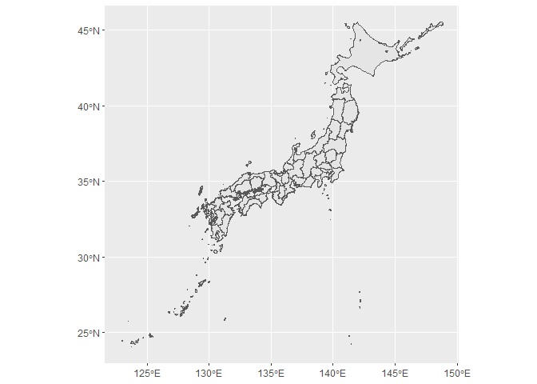
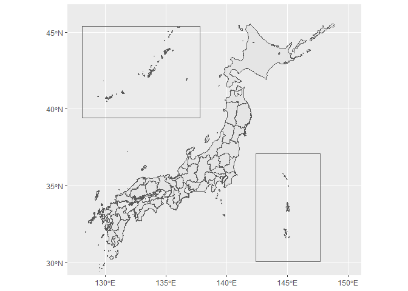
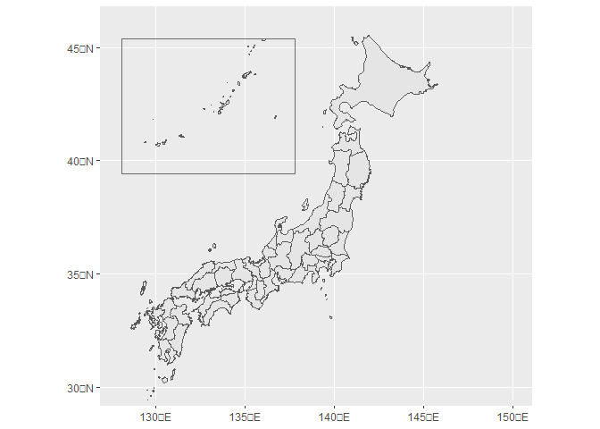

<!-- README.md is generated from README.Rmd. Please edit that file -->

# jpmap

<!-- badges: start -->
<!-- badges: end -->

jpmap provides geometry data of Japanese prefectures and layout
functions in ggplot2. The prefecture data in jpmap is based on the data
provided by mapdata package.

## Installation

You can install the development version of jpmap from
[GitHub](https://github.com/) with:

``` r
# install.packages("devtools")
devtools::install_github("UchidaMizuki/jpmap")
```

## Example

`prefecture` contains geometry (sf) data of Japanese prefectures.

``` r
library(jpmap)
library(tidyverse)
library(sf)

prefecture
#> Simple feature collection with 47 features and 3 fields
#> Geometry type: MULTIPOLYGON
#> Dimension:     XY
#> Bounding box:  xmin: 122.935 ymin: 24.0433 xmax: 148.8678 ymax: 45.5386
#> Geodetic CRS:  WGS 84
#> # A tibble: 47 × 4
#>    pref_code pref_name pref_name_ja                                         geom
#>        <int> <chr>     <chr>                                  <MULTIPOLYGON [°]>
#>  1         1 Hokkaido  北海道       (((145.2498 43.6126, 145.1639 43.6385, 145.…
#>  2         2 Aomori    青森県       (((139.8692 40.5863, 139.8745 40.5802, 139.…
#>  3         3 Iwate     岩手県       (((140.6595 39.3864, 140.6785 39.3829, 140.…
#>  4         4 Miyagi    宮城県       (((141.0347 38.2792, 141.0384 38.2868, 141.…
#>  5         5 Akita     秋田県       (((139.8725 39.1156, 139.9496 39.1106, 139.…
#>  6         6 Yamagata  山形県       (((139.5506 38.5498, 139.5527 38.5508, 139.…
#>  7         7 Fukushima 福島県       (((139.208 37.1909, 139.2164 37.1969, 139.2…
#>  8         8 Ibaraki   茨城県       (((139.6911 36.1965, 139.6988 36.1541, 139.…
#>  9         9 Tochigi   栃木県       (((139.3358 36.6239, 139.3489 36.6227, 139.…
#> 10        10 Gunma     群馬県       (((138.4448 36.4195, 138.4606 36.4156, 138.…
#> # … with 37 more rows
```

`layout_islands()` improves the layout of the Japanese islands in
ggplot2 plots.

``` r
plot <- ggplot(prefecture) +
  geom_sf()

plot
```



``` r
layout_islands(plot)
```



``` r
layout_islands(plot,
               ogasawara = FALSE)
```



``` r
data <- prefecture |> 
  expand_grid(group = 1:2) |> 
  st_as_sf() |> 
  mutate(value = rnorm(n()))

plot <- ggplot(data,
               aes(fill = value)) +
  geom_sf(color = "transparent") +
  scale_fill_viridis_c(option = "turbo") +
  facet_wrap(~ group)

layout_islands(plot) +
  theme(legend.position = "bottom")
```


