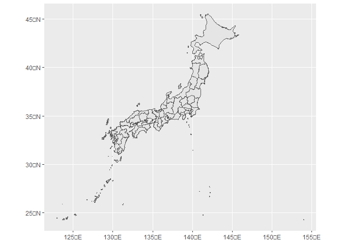
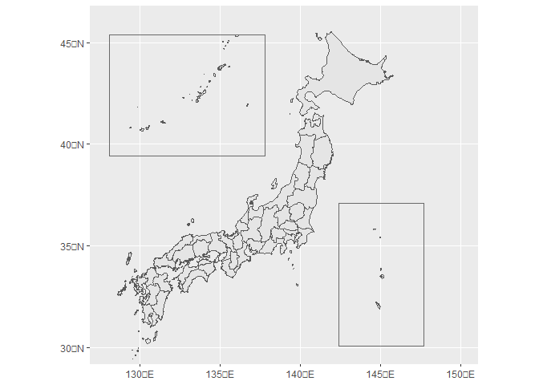
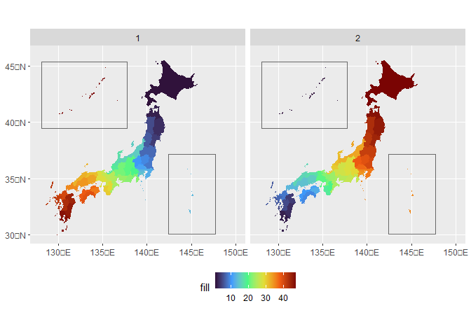

<!-- README.md is generated from README.Rmd. Please edit that file -->

# jpmap 

<!-- badges: start -->
<!-- badges: end -->

jpmap provides geometry data of Japanese prefectures and layout
functions in ggplot2. The prefecture data in jpmap is based on the data
provided by mapdata package.

## Installation

You can install the development version of jpmap from
[GitHub](https://github.com/) with:

``` r
# install.packages("devtools")
devtools::install_github("UchidaMizuki/jpmap")
```

## Example

`prefecture` contains geometry (sf) data of Japanese prefectures.

``` r
library(jpmap)
library(tidyverse)
library(sf)

prefecture
#> Simple feature collection with 47 features and 3 fields
#> Geometry type: MULTIPOLYGON
#> Dimension:     XY
#> Bounding box:  xmin: 122.9382 ymin: 24.2121 xmax: 153.9856 ymax: 45.52041
#> Geodetic CRS:  JGD2011
#> # A tibble: 47 × 4
#>    pref_code pref_name pref_name_ja                                     geometry
#>        <int> <chr>     <chr>                                  <MULTIPOLYGON [°]>
#>  1         1 Hokkaido  北海道       (((143.8965 44.15815, 143.9118 44.15229, 14…
#>  2         2 Aomori    青森県       (((139.9438 40.42928, 139.9426 40.43439, 13…
#>  3         3 Iwate     岩手県       (((141.681 40.45101, 141.6909 40.44229, 141…
#>  4         4 Miyagi    宮城県       (((141.6403 38.9675, 141.6406 38.9652, 141.…
#>  5         5 Akita     秋田県       (((139.8809 39.11511, 139.8919 39.13321, 13…
#>  6         6 Yamagata  山形県       (((139.5487 38.545, 139.5801 38.60688, 139.…
#>  7         7 Fukushima 福島県       (((140.9332 37.8898, 140.9334 37.88923, 140…
#>  8         8 Ibaraki   茨城県       (((140.7973 36.84649, 140.7931 36.83755, 14…
#>  9         9 Tochigi   栃木県       (((139.6537 36.20314, 139.6385 36.22575, 13…
#> 10        10 Gunma     群馬県       (((138.6795 36.73065, 138.7227 36.74918, 13…
#> # … with 37 more rows
```

`layout_japan()` improves the layout of the Japanese islands in ggplot2
plots.

``` r
plot <- ggplot(prefecture) +
  geom_sf()

plot
```



``` r
layout_japan(plot)
```



``` r
layout_japan(plot,
             ogasawara = FALSE)
```


``` r
data <- prefecture |> 
  expand_grid(group = 1:2) |> 
  st_as_sf() |> 
  mutate(fill = case_when(group == 1 ~ pref_code,
                          group == 2 ~ 47L - pref_code + 1L))

plot <- ggplot(data,
               aes(fill = fill)) +
  geom_sf(color = "transparent") +
  scale_fill_viridis_c(option = "turbo") +
  facet_wrap(~ group)

layout_japan(plot) +
  theme(legend.position = "bottom")
```


